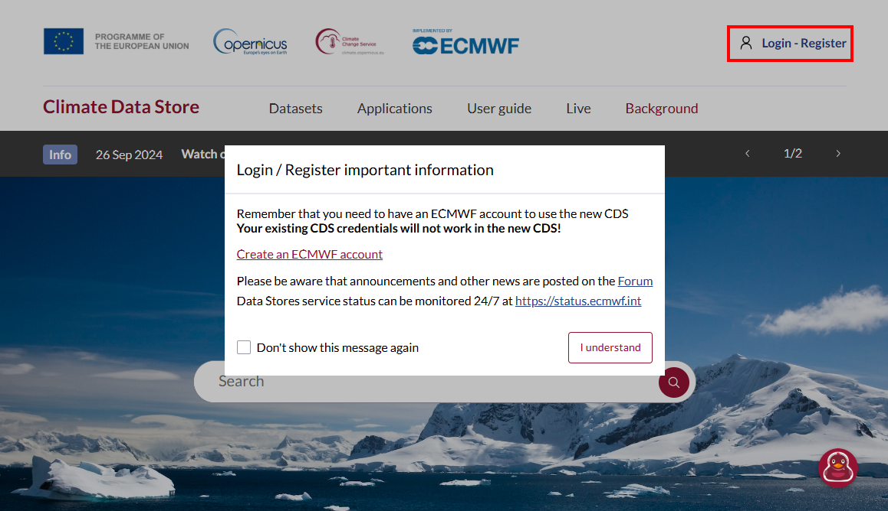

=========
Element 1
=========

.. _kurs1-element1:

---------
Lernziele
---------

* :ref:`Einrichtung der API des Copernicus Climate Data Store (CDS API) <einrichtung_api>`
	* :ref:`Persönlicher API-Key <pers_api_key>`
	* :ref:`Installation der CDS API <install_cdsapi>`
* :ref:`Download des ersten Klima-Datensatzes <cds_download>`
	* :ref:`Erstellen der API-Request <api_request>`
	* :ref:`Die API-Request im Jupyter Notebook <api_jupyter>`

----

.. _einrichtung_api:

-----------------------
Einrichtung der CDS API
-----------------------

Zur Einrichtung der CDS API (Application Programming Interface, notwendige Installation um Daten aus dem CDS herunterzuladen) benötigen Sie einen Nutzeraccount im Copernicus Climate Data Store (CDS). Diesen richten Sie direkt über den `CDS <https://cds.climate.copernicus.eu/>`_ ein.

Falls Sie noch keinen Nutzeraccount haben erstellen Sie sich einen Account über die Startseite. Oben rechts im Fenster klicken Sie auf "Login/Register". Das Dialogfenster erscheint wie unten angezeigt. Erstellen Sie sich einen ECMWF-Account wie beschrieben und loggen Sie sich dann mit Ihrem ECMWF-Nutzernamen und Passwort im Copernicus CDS ein.

.. _pers_api_key:

^^^^^^^^^^^^^^^^^^^^^^^
1. Persönlicher API-Key
^^^^^^^^^^^^^^^^^^^^^^^

Nach dem Login können Sie sich in Ihrem Account Ihre API-Informationen ansehen. Den API-Key (oder API-Token) benötigen Sie im nächsten Schritt.

.. image:: ../_static/kurs_1_cds_2.png
	:width: 650px
	:align: center
	:class: no-scaled-link
	:alt: CDS API key

Laden Sie sich die folgende Datei herunter, entpacken und öffnen Sie die Datei und ergänzen Sie Ihren persönlichen API-Key in der zweiten Zeile (anstelle von ####).

.. raw:: html

   

       <a href="../_static/_cdsapirc.zip" download>⇩ CDS API (zip)</a>
   

Speichern Sie das Dokument. Legen sie das Dokument in Ihrem Benutzerlaufwerk ab (C:\Users\Nutzername\)

.. _install_cds_api:

^^^^^^^^^^^^^^^^^^^^^^^^^^^
2. Installation der CDS API
^^^^^^^^^^^^^^^^^^^^^^^^^^^

Nun sind Sie bereit, die CDS API zu installieren. Öffnen Sie die CMD (Eingabeaufforderung) und geben Sie folgenden Befehl ein

	.. code-block::

		pip install cdsapi

Sie sollten nun alle Voraussetzungen erfüllt haben um Daten aus dem CDS herunterzuladen. Im nächsten Schritt probieren wir dies mit einem Testdatensatz aus.

----

.. _cds_download:

-----------------------------------
Download von Klimadaten aus dem CDS
-----------------------------------

Unser Testdatensatz ist der Reanalyse-Datensatz ERA5. Falls Sie sich mit dem Datensatz gut auskennen, können Sie den Infokasten überspringen und gleich zum :ref:`nächsten Schritt <era5download>` übergehen.

.. note::
	Der ERA5-Klimadatensatz ist eine umfangreiche Sammlung von Wetter- und Klimadaten, die von der 	Europäischen Organisation für die Nutzung meteorologischer Satelliten (ECMWF) erstellt wurde. Es 	handelt sich dabei um eine historische Wetter- und Klimadatenbank, die auf modernen Rechenmodellen und 	Satellitenmessungen basiert. ERA5 umfasst kontinuierliche Wetterdaten der letzten Jahrzehnte, von 1950 	bis in die Gegenwart. Diese Daten umfassen unter anderem Temperatur, Luftfeuchtigkeit oder 	Windgeschwindigkeit.

	In Wissenschaft und Klimaforschung wird der ERA5-Datensatz genutzt, um langfristige Klimatrends zu 	untersuchen. Zum Beispiel kann anhand der Daten analysiert werden, wie sich die Temperaturen im 	Verlauf von Jahrzehnten verändert haben oder wie sich die Frequenz von Extremwetterereignissen 	entwickelt.

	Kurz gesagt, der ERA5-Datensatz ist eine wertvolle Wissensquelle für viele verschiedene Disziplinen 	und Bereiche, weil er fundierte und verlässliche Daten für die Analyse des globale Klimasystems 	bereitstellt. Der ERA5-Datensatz dient auch als Grundlage für die Entwicklung von Klimamodellen und 	Wettervorhersagen. Er hilft, genauere und realistischere Prognosen zu erstellen, was für zukünftiges 	Risikomanagement relevant ist.

.. _api_request:

^^^^^^^^^^^^^^^^^^^^^^^^^^^^
1. Erstellen der API-Request
^^^^^^^^^^^^^^^^^^^^^^^^^^^^

.. _era5_download:

Die im CDS verfügbaren Datensätze können durch die räumliche und zeitliche Abdeckung schnell mehrere Gigabyte Größe erreichen. Im CDS haben Sie die Möglichkeit, individuell Variablen, Zeiträume und Regionen auszwählen, damit der Datensatz nicht unnötig Speicherplatz auf Ihrem Computer verbraucht. Für den Test laden wir nur einen kleinen Teil des Datensatzes herunter (eine Variable für einen Tag im Oktober 2024).

Um die gewünschten Daten automatisiert über die CDS API herunterzuladen müssen Sie zunächst einen API request code erzeugen. Dafür gehen Sie in den Copernicus Climate Data store, loggen sich ein und suchen nach dem Datensatz `ERA5-Land hourly data from 1950 to present <https://cds.climate.copernicus.eu/datasets/reanalysis-era5-land?tab=overview>`_

Gehen Sie auf den `Download-Tab <https://cds.climate.copernicus.eu/datasets/reanalysis-era5-land?tab=download>`_ und wählen Sie die Parameter wie folgt aus:

	* Temperature: 2m temperature
	* Year: 2024
	* Month: October
	* Day: 01
	* Time: Select all

Die Region Ihrer Wahl könnnen Sie im Bereich "Geographical Area" festlegen. Dies sollten Sie tun, damit der Datensatz nicht für den gesamten, verfügbaren Bereich heruntergeladen wird.

wir haben für Sie die Koordinaten für die Region rund um den Bodensee vorbereitet, der Test-Region des CoKLIMAx-Projekts.

.. image:: ../_static/kurs_1_cds_3.png
	:width: 650px
	:align: center
	:class: no-scaled-link
	:alt: Download region

.. note::
	Ihre eigenen Wunschkoordinaten können Sie sich ganz einfach im von uns entwickelten `Bbox-Generator <https://str-ucture.github.io/bbox-extractor/>`_ erstellen. Kopieren Sie sich die Koordinaten in die Zwischenablage oder in ein Textdokument. Diese können später auch noch direkt im Jupyter-Notebook eingegeben werden.

Für die weiteren Parameter Datenformat und Komprimierung setzen Sie die Felder in der Eingabemaske bitte wie in der folgenden Abbildung gezeigt.

.. image:: ../_static/kurs_1_cds_4.png
	:width: 650px
	:align: center
	:class: no-scaled-link
	:alt: Data and download fromat

Sobald Sie die Nutzungsbedingungen akzeptiert haben müssen Sie nur noch auf "Show API request code" klicken und der automatisch generierte API request code erscheint. Für unsere Testdaten sieht dieser wie folgt aus:

	.. code-block::

		import cdsapi

		dataset = "reanalysis-era5-land"
		request = {
				"variable": ["2m_temperature"],
				"year": "2024",
				"month": "10",
				"day": ["01"],
				"time": [
				"00:00", "01:00", "02:00",
				"03:00", "04:00", "05:00",
				"06:00", "07:00", "08:00",
				"09:00", "10:00", "11:00",
				"12:00", "13:00", "14:00",
				"15:00", "16:00", "17:00",
				"18:00", "19:00", "20:00",
				"21:00", "22:00", "23:00"
			],
			"data_format": "netcdf",
			"download_format": "zip",
			"area": [48.7, 7, 47.1, 11]
		}

		client = cdsapi.Client()
		client.retrieve(dataset, request).download()

.. _api_jupyter:

^^^^^^^^^^^^^^^^^^^^^^^^^^^^^^^^^^^^^^
2. Die API-Request im Jupyter Notebook
^^^^^^^^^^^^^^^^^^^^^^^^^^^^^^^^^^^^^^

Öffnen Sie Ihr Jupyter lab über die Eingabeaufforderung (cmd)

	.. code-block::

		jupyter lab

Falls das Öffnen des Jupyter labs nicht funktioniert gehen Sie am besten noch einmal die Anleitung durch, die wir :ref:`hier <software-to-run-jupyter>` für Sie vorbereitet haben.

Wir haben ein Jupyter Notebook für Sie vorbereitet, in dem Sie nur den Output-Ordner und Ihren API Key anpassen müssen. Sie können das Notebook unter folgendem Link herunterladen:

.. raw:: html

   

       <a href="../_static/element1_api_test.ipynb" download>⇩ Element1: Test Notebook</a>
   

Öffnen Sie das Notebook in Ihrem Jupyter lab und folgen Sie den Anweisungen.